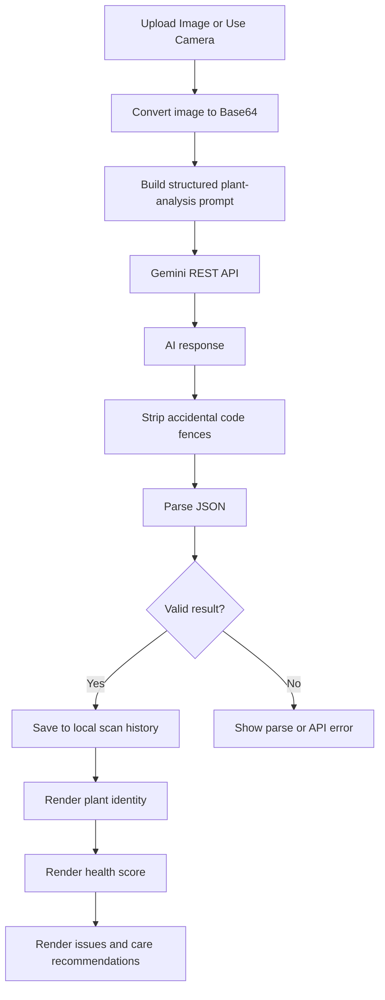
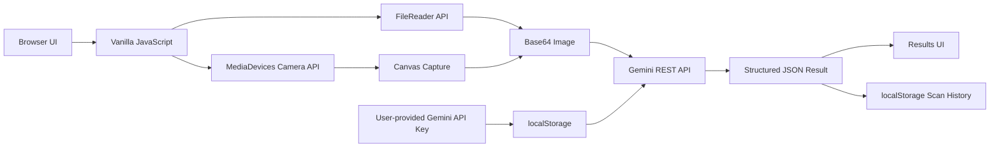

<div align="center">

# PlantScan AI

**AI-assisted plant identification and visual health analysis in the browser**

[GitHub Repository](https://github.com/Anna-Vida/Plant-Health-AI)


</div>

---

## Overview

**PlantScan AI** is a lightweight browser-based plant identification and visual health analysis application.

Users can upload a plant photo or capture one directly with their device camera. The application sends the image to Google Gemini together with a structured analysis prompt, then presents the returned plant identity, health score, possible issues, care recommendations, and an educational plant fact.

The entire application is implemented with **HTML, CSS, and vanilla JavaScript**. It has no application server and no database. Recent scan history and the user-provided Gemini API key are stored locally in the browser.

> PlantScan AI is an educational portfolio project. AI-generated plant identification and health suggestions can be incomplete or incorrect and should not be treated as a professional agricultural, botanical, or plant-pathology diagnosis.

---

## What This Project Demonstrates

- Browser-based image analysis with a multimodal AI API
- Direct REST integration with Google Gemini
- Camera access through the Web Media API
- Image upload, drag-and-drop, preview, and capture workflows
- Base64 image encoding for multimodal requests
- Structured AI prompting and JSON parsing
- Defensive response parsing and error handling
- Local browser persistence with `localStorage`
- Responsive interface design with vanilla CSS
- Dynamic UI state management without a frontend framework
- Accessible fallback from camera capture to file upload
- Client-side scan history management

---

## Core Features

### Plant Identification

PlantScan AI asks Gemini to identify:

- Scientific plant name
- Common name

The application expects structured JSON rather than free-form text so the result can be rendered consistently in the interface.

### Visual Health Analysis

Each scan can return:

- Health score from `0` to `100`
- Health status
- Possible diseases
- Possible pest symptoms
- Possible environmental stress indicators
- Care recommendations

The UI groups scores into:

```text
80–100  → Healthy
50–79   → Moderate
0–49    → Critical
```

The health bar and status badge are updated dynamically from the returned result.

### Image Upload

Users can:

- Browse for an image
- Drag and drop an image into the scan area
- Preview the selected image before analysis

Uploaded files are converted to Base64 in the browser before being sent to Gemini.

### Live Camera Scanner

PlantScan AI uses:

```javascript
navigator.mediaDevices.getUserMedia()
```

to request the device camera.

The camera flow supports:

```text
Open camera
    ↓
Use environment-facing camera when available
    ↓
Capture frame to canvas
    ↓
Convert frame to JPEG
    ↓
Preview image
    ↓
Analyze plant
```

If camera access is unavailable or denied, users can still upload an image.

### Scan History

The application stores the most recent **8 scans** in browser `localStorage`.

Each stored entry contains information such as:

- Plant name
- Common name
- Status
- Health score
- Scan timestamp
- AI result
- Captured image data

Users can open the history sidebar and clear stored scan history.

---

## AI Analysis Flow



---

## Expected AI Response

The application asks Gemini to return an object shaped like:

```json
{
  "plantName": "Scientific name",
  "commonName": "Common name",
  "healthScore": 85,
  "status": "Healthy",
  "issues": [],
  "careRecommendations": [
    "Example care recommendation"
  ],
  "funFact": "An educational fact about the plant."
}
```

The prompt also includes a specific fallback structure for images where no plant is detected.

---

## Model Integration

The current implementation calls the Gemini REST API directly from the browser.

The model identifier in the source code is:

```text
gemini-2.5-pro-preview-03-25
```

The request includes:

- A structured text prompt
- Base64-encoded plant image
- Image MIME type
- Low-temperature generation configuration
- Maximum output-token setting

The endpoint is constructed from:

```text
https://generativelanguage.googleapis.com/v1beta/models
```

Because the model name is a preview identifier, it may need to be updated if Google changes or retires that model version.

---

## Architecture



There is currently **no backend server** between the browser and Gemini.

---

## Tech Stack

| Area | Technology |
| --- | --- |
| **Frontend** | HTML5 |
| **Styling** | CSS3 |
| **Application logic** | Vanilla JavaScript |
| **AI** | Google Gemini REST API |
| **Camera** | MediaDevices / `getUserMedia()` |
| **Image capture** | HTML Canvas API |
| **Image loading** | FileReader API |
| **Persistence** | Browser `localStorage` |
| **Fonts** | Google Fonts — Inter, Space Grotesk |

---

## Project Structure

```text
Plant-Health-AI/
├── index.html
├── style.css
├── app.js
└── README.md
```

### `index.html`

Contains:

- Application layout
- API-key modal
- Scanner interface
- Camera viewfinder
- Loading state
- Results panel
- Scan-history sidebar
- Error states

### `style.css`

Contains the complete visual system, including:

- Responsive layout
- Dark plant-themed design
- Glass-style surfaces
- Health status colors
- Animations
- Camera and scanner states
- History sidebar styling

### `app.js`

Handles:

- Gemini API requests
- API-key state
- Camera access
- File upload
- Image encoding
- AI prompt generation
- Response parsing
- Results rendering
- Error handling
- Scan history

---

## Getting Started

### Requirements

You only need:

- A modern browser
- A Google Gemini API key
- Internet access for AI analysis

No package installation or build step is required.

### Clone the Repository

```bash
git clone https://github.com/Anna-Vida/Plant-Health-AI.git
cd Plant-Health-AI
```

### Option 1 — Run with Python

```bash
python -m http.server 8080
```

Then open:

```text
http://localhost:8080
```

### Option 2 — Run with Node.js

If Node.js is installed:

```bash
npx serve .
```

Open the local URL printed in the terminal.

### Direct File Mode

You can also open `index.html` directly for basic image-upload usage.

Camera functionality generally requires a secure browser context such as:

```text
https://
```

or:

```text
http://localhost
```

---

## Gemini API Key

When the application first opens, it asks the user for a Gemini API key.

The current implementation stores that value under:

```text
plantscan_api_key
```

inside browser `localStorage`.

The key is then used directly from the browser when calling Google's Gemini endpoint.

### Development setup

Create a Gemini API key through Google AI Studio and enter it in the application's API-key dialog.

The app also provides a control for replacing the saved key later.

---

## Privacy and Security Notes

PlantScan AI is intentionally simple and client-side, but that comes with important security implications.

### What stays local

The application does not have its own application server or database.

The following data is stored in the user's browser:

- Gemini API key
- Recent scan history
- Scan results
- Captured/uploaded image data included in recent history

### What leaves the browser

When the user analyzes a plant, the selected image is sent to the Google Gemini API along with the analysis prompt.

### API-key limitation

`localStorage` is **not a secure secret store**.

Because the Gemini key is available to browser JavaScript, a production version should not depend on a privileged or unrestricted API key stored this way.

A stronger production architecture would use:

```text
Browser
   ↓
Authenticated / rate-limited backend
   ↓
Server-side Gemini credential
   ↓
Gemini API
```

The current direct-key design is better suited to a personal, educational, or prototype application.

---

## Error Handling

The interface includes dedicated handling for:

- Missing API key
- Invalid API key
- Unauthorized API access
- Network failure
- Empty AI response
- Invalid JSON response
- Camera not supported
- Camera permission denied

If Gemini accidentally wraps the JSON response in Markdown code fences, the application removes those markers before parsing.

If parsing still fails, the UI displays an explicit error rather than silently generating fallback plant information.

---

## UI States

The application uses explicit screen states:

```text
Scan
Loading
Results
Error
```

During analysis, a staged loading interface communicates progress through:

```text
Identifying species
        ↓
Diagnosing health
        ↓
Generating care tips
```

These are user-interface progress indicators; they do not represent separate AI API calls.

---

## Current Implementation Status

### Implemented

- Image upload
- Drag-and-drop image selection
- Camera capture
- Environment-facing camera preference
- Image preview
- Gemini multimodal analysis
- Scientific/common name extraction
- Visual health score
- Health status
- Issue detection output
- Care recommendations
- Fun facts
- No-plant handling prompt
- Loading states
- API error handling
- Camera permission handling
- Scan history
- History clearing
- API-key management
- Responsive plant-themed interface

### Current Limitations

- No backend proxy for Gemini credentials
- No user accounts
- No cloud scan history
- No automated test suite
- No independent plant-disease verification model
- No offline AI analysis
- No confidence score from a validated classifier
- Health score is generated by the language/vision model rather than a calibrated diagnostic system
- Scan history is browser-specific
- Gemini preview model identifier may eventually require replacement

---

## Possible Future Improvements

- Add a server-side Gemini proxy
- Add API-key protection and server-side rate limiting
- Add automated unit and browser tests
- Add a dedicated plant-disease dataset or classifier
- Add confidence/provenance indicators
- Add user accounts and optional cloud scan history
- Add offline plant reference information
- Add location-aware seasonal care guidance
- Add exportable plant-care reports
- Add image compression before API submission
- Add PWA support for installable mobile use
- Add accessibility testing and reduced-motion support

---

## Author

**Anna Patricia B. Vida**

- GitHub: [Anna-Vida](https://github.com/Anna-Vida)
- LinkedIn: [annavida12](https://www.linkedin.com/in/annavida12/)

---

## Disclaimer

PlantScan AI is a portfolio and educational project.

AI-generated species identification, health scores, disease suggestions, pest observations, and care recommendations may be inaccurate. Before applying pesticides, fungicides, fertilizers, or other potentially harmful treatments, verify the diagnosis and treatment with reliable horticultural guidance or a qualified plant professional.